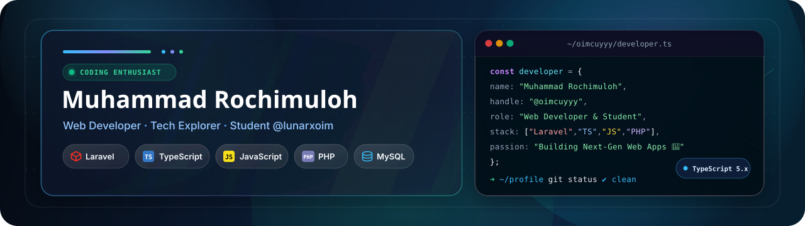

# 

<!-- <h1 align="center">oimcuyyy</h1> -->

  ☕ Coding Enthusiast | 💻 Web Developer | 🚀 Student at @lunarxoim

  
  

## Tech Stack

  
  
  
  
  
  
  
  
  
  

## Popular Repositories

| Repository | Description / Tech Stack |
| :--- | :--- |
| **[Form-Login](https://github.com/oimcuyyy/Form-Login)** | Login form UI | **CSS** |
| **[tugas-portofolio](https://github.com/oimcuyyy/tugas-portofolio)** | Portfolio assignment | **CSS** |
| **[seterah-dah](https://github.com/oimcuyyy/seterah-dah)** | Web project | **CSS** |
| **[my-digital-portfolio](https://github.com/oimcuyyy/my-digital-portfolio)** | Portofolio saya | **TypeScript** |
| **[project-kelompok](https://github.com/oimcuyyy/project-kelompok)** | Team project | **Blade / Laravel** |
| **[portfolio-laravel](https://github.com/oimcuyyy/portfolio-laravel)** | Portfolio built with Laravel | **Blade / Laravel** |

## Currently Building

Building and exploring web development projects, sharpening skills in frontend interfaces, TypeScript, and Laravel ecosystem.

## GitHub Statistics

<table>
  <tr>
    <td width="50%" align="center">
      
    </td>
    <td width="50%" align="center">
      
    </td>
  </tr>
</table>

  <picture>
    <source media="(prefers-color-scheme: dark)" srcset="https://raw.githubusercontent.com/oimcuyyy/oimcuyyy/output/galaga-contribution-graph-dark.svg" />
    <source media="(prefers-color-scheme: light)" srcset="https://raw.githubusercontent.com/oimcuyyy/oimcuyyy/output/galaga-contribution-graph.svg" />
    
  </picture>

